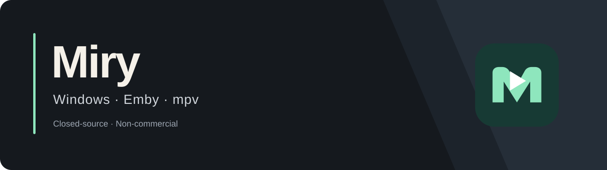

# Miry

  
  
  
  

<strong>Windows 上的 Emby 桌面观看体验</strong> 个人维护 · 非商业 · v1.0.3 已发布

  <a href="#功能特性">功能特性</a> ·
  <a href="#下载与版本">下载与版本</a> ·
  <a href="CHANGELOG.md">更新日志</a> ·
  <a href="#在线弹幕">在线弹幕</a> ·
  <a href="#反馈与建议">反馈与建议</a> ·
  <a href="#隐私与使用说明">隐私与使用说明</a>

---

Miry 是一款面向 Windows 的第三方 Emby 桌面客户端，使用原生 mpv 作为播放核心，专注于电影、电视剧和动画的桌面观看体验。

连接自己的 Emby 服务器，浏览媒体库、选择媒体版本、调节字幕与弹幕，并同步播放进度。Miry 本身不提供影视资源或服务器账号。

## 功能特性

| 功能 | 说明 |
| --- | --- |
| 服务器管理 | Emby 服务器连接、多服务器管理与切换 |
| 原生播放 | Windows 原生 mpv 播放，支持 Direct Play / Direct Stream / Transcode / HLS |
| 媒体版本 | 在同一作品的多个媒体版本之间选择 |
| 字幕 | 主字幕 / 次字幕，字幕大小与位置实时调节 |
| 本地弹幕 | 加载本地 Bilibili XML / ASS 弹幕 |
| 在线弹幕 | 作品搜索、自动 / 手动匹配与只读弹幕展示 |
| 搜索 | 首页与媒体库影视搜索、中文输入与清空恢复 |
| 分页跳转 | 输入页码，Enter或按钮直接跳转，保留筛选与搜索上下文 |
| 观看管理 | 播放进度同步、收藏、待看清单与观看记录 |
| 多线路 | Smart Route 多线路切换 |
| 界面 | Dark / Light / System 主题、UI 字号与可折叠侧栏 |
| Windows 集成 | 系统媒体控制、正式安装程序与手动版本检查 |

## 下载与版本

| 项目 | 当前状态 |
| --- | --- |
| 平台 | Windows |
| 当前版本 | Miry v1.0.3 |
| 发布状态 | Maintenance Release · RELEASED |
| 主要发行形式 | Windows NSIS 安装程序 |
| 项目性质 | 个人维护、非商业、Closed-source（闭源） |

Miry v1.0.3 已正式发布：[版本说明](https://github.com/Lomiry/Miry/releases/tag/v1.0.3) · [下载 Windows 安装程序](https://github.com/Lomiry/Miry/releases/download/v1.0.3/Miry-Setup-v1.0.3.exe)。

安装程序包含 mpv 运行时，采用当前用户安装；用户数据保存在独立的 AppData 中。WebView2 缺失时由官方引导程序安装，可能需要联网。

About 中可手动检查新版本并查看发布页面。当前不提供自动下载安装或后台更新。

更新内容见 [更新日志](CHANGELOG.md)。1.0.3 改进影视与弹幕搜索、推荐候选和匹配理由，重新标定默认1×弹幕速度，并新增媒体库页码直接跳转；既有卡片和播放功能保留。

本仓库用于项目介绍、开发进度展示和第三方服务接入审核。

## 在线弹幕

Miry 已完成弹弹play开放弹幕网络的接入实现，用于作品搜索、自动/手动匹配以及只读弹幕展示。

发布版已内置接入，无需用户导入服务配置。正式作品搜索、电影弹幕样本及原生绘制和时钟同步已通过验证；不保证所有电影、电视剧都有可匹配的弹幕。

在线弹幕通过弹弹play官方开放 API 接入，不使用网页抓取、Cookie 模拟或非公开接口。

Miry 不提供弹幕发送、弹弹play用户登录、批量弹幕下载或社区功能。

## 已知限制

- 当前 Windows 安装程序未签名，SmartScreen 可能提示警告。
- 真实远程 Emby、长时间播放及部分 HDR / Dolby Vision / AVR / DPI 环境仍需实机验证。
- Miry 不修改 Windows 显示器刷新率，也不自动切换 Windows HDR。

## 反馈与建议

使用问题与功能建议可以通过 [GitHub Issues](https://github.com/Lomiry/Miry/issues) 提交。

请说明遇到问题时的操作步骤、Miry 版本和预期行为，以便定位问题。

## 隐私与使用说明

### 隐私

Miry 不会向弹幕服务发送 Emby Token、服务器地址、用户账号、媒体服务器凭据或播放历史。

在线匹配仅使用作品标题、年份、季集信息及服务支持的作品 ID。

### 媒体来源

Miry 展示和播放的媒体来自用户自行配置的 Emby 服务器。本应用不托管或分发影视内容；请使用自己有权访问的媒体服务和内容。

## License

Miry 当前为闭源项目。

本仓库仅用于项目介绍、开发进度展示和第三方服务接入审核，不代表 Miry 源代码以开源许可证发布。

安装程序所含 mpv 和其他第三方组件遵循各自许可证。v1.0.3 沿用完全相同的运行时及依赖，完整第三方对应源码、构建说明和校验材料继续免费提供，精确获取方式见 [当前版本源码说明](https://github.com/Lomiry/Miry/releases/download/v1.0.3/THIRD-PARTY-SOURCES.md)；原始分册保持在 [v1.0.1 Release](https://github.com/Lomiry/Miry/releases/tag/v1.0.1)。第三方源码不含 Miry 应用源码；普通用户只需下载安装程序。
